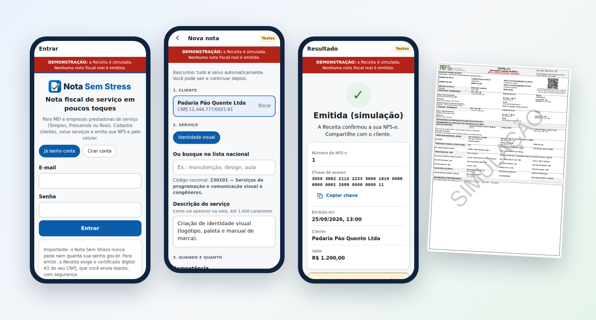

<p align="center">
  <picture>
    <source media="(prefers-color-scheme: dark)" srcset="docs/assets/marca-nota-sem-stress-escuro.svg">
    
  </picture>
</p>

<h3 align="center">Nota fiscal de serviço sem stress, pelo celular.</h3>

<p align="center">
  App instalável (PWA) para emitir a <strong>NFS-e do Padrão Nacional</strong> em poucos toques:<br>
  MEI, ME/EPP do Simples Nacional, Lucro Presumido e Lucro Real.
</p>

<p align="center">
  
  
  
  
  
</p>

<p align="center">
  <a href="#como-experimentar"><strong>Experimentar em 1 minuto</strong></a> ·
  <a href="docs/02-fluxo-e-prototipo.md">Ver todas as telas</a> ·
  <a href="docs/01-requisitos-oficiais.md">Requisitos oficiais</a>
</p>

<p align="center">
  
</p>

> [!IMPORTANT]
> **Situação atual:** o app funciona de ponta a ponta contra uma Receita **simulada**, com testes automatizados de emissão, contas e sincronização offline. **Falta a primeira emissão no ambiente oficial de homologação**, que depende de um certificado A1 real ([roteiro em `docs/05`](docs/05-testes-homologacao.md#52-roteiro-no-ambiente-oficial-de-produção-restrita)).

## Por que Nota Sem Stress

| | |
|---|---|
| **Emitir em poucos toques** | Cliente e serviço salvos, valor sugerido, revisão em uma tela. **"Clonar última nota"** refaz a nota do mês com novos identificadores e pede para conferir competência, valor, descrição e tributação. |
| **Sem susto com a Receita** | As regras oficiais (Anexo I) rodam **antes** do envio e aparecem em linguagem comum. Se a resposta não vier, o app **consulta antes de reenviar** e mantém a mesma DPS nos reenvios. |
| **Honesto sobre a situação** | "Emitida" só aparece com a chave de acesso oficial. Rascunho, envio pendente e simulação nunca se passam por nota fiscal. |
| **Pronto para imprimir e enviar** | **DANFSe em PDF no modelo da NT 008**, com QR Code da Consulta Pública, gerado a partir do XML oficial. "Enviar ao cliente" manda o PDF e o XML pelo WhatsApp ou e-mail. |
| **Funciona sem internet** | Prepara a nota offline como rascunho e avisa que ela **ainda não foi emitida**. |
| **Dados protegidos** | Não pede nem guarda a senha gov.br. Certificado A1, CPF, CNPJ e dados dos clientes ficam cifrados (AES-256-GCM), e toda operação fica registrada. |

## Para quem

| Regime | O que o app faz |
|---|---|
| **MEI** | Emite com a tributação do MEI já resolvida. |
| **ME/EPP do Simples Nacional** | Confere o convênio do município, retenção do ISS pelo cliente, ISS fora do Simples e `% aproximado` de tributos. |
| **Lucro Presumido / Real** | PIS/COFINS, retenções federais (NT 007) e o grupo **IBS/CBS** com as opções oficiais para cada serviço (Ato Conjunto RFB/CGIBS nº 4/2026). |

## DANFSe local (NT 008)

A API de DANFSe da Receita foi desativada em 03/08/2026, e o documento auxiliar passou a ser gerado por quem emite. O Nota Sem Stress gera o PDF **a partir do XML oficial da NFS-e** (nunca do rascunho), seguindo a NT 008 v1.02:

- A4 retrato, **página única**, blocos e grade do Anexo I, sombreamento e espessuras de linha da norma.
- Cabeçalho com a logomarca da NFS-e, **"DANFSe v2.0"** e, em homologação, **"NFS-e SEM VALIDADE JURÍDICA"** em vermelho.
- QR Code para `nfse.gov.br/ConsultaPublica` com a chave de acesso.
- Descrições em vez de códigos, reticências nos limites da NT, traço nos campos vazios e as supressões permitidas (tomador, destinatário, intermediário, ISSQN).
- Linha de **Totais Aproximados dos Tributos** (Lei 12.741/2012) sempre presente.
- No modo demonstração, marca d'água **"SIMULAÇÃO"**.

[Veja um exemplo em PDF](docs/exemplos/danfse-demonstracao.pdf) · rota `GET /api/notas/{id}/danfse`

## Como experimentar

Requisitos: **Node.js 22.16+** (usa `node:sqlite`).

```bash
cd server
npm install
npm run demo      # abre em http://localhost:8080 com a Receita SIMULADA
```

O terminal mostra um CNPJ e um certificado **fictício** para testar o app inteiro. Uma faixa vermelha fixa avisa que nada ali é nota fiscal real.

```bash
npm test          # regras fiscais, emissão, contas, offline, operação e segurança
npx playwright install chromium
npm run test:web  # fluxo móvel no Chromium, com Receita simulada e CSP ativa
```

<details>
<summary><strong>Colocar em produção (homologação primeiro)</strong></summary>

```bash
export NOTAVEZ_MASTER_KEY=$(npm run -s gerar-chave)   # guarde num cofre/KMS; protege certificados e dados
export NOTAVEZ_DB=/dados/notavez.db
npm start                                             # ambiente padrão: produção restrita (testes da Receita)
# Só depois de homologar:
export NOTAVEZ_PRODUCAO_LIBERADA=1
```

Sirva atrás de HTTPS (proxy reverso). Variáveis úteis: `PORT`, `NOTAVEZ_TIMEOUT_SEFIN_MS` (30000), `NOTAVEZ_ESPERA_REENVIO_MS` (60000), `NOTAVEZ_C14N`, `NOTAVEZ_SERVIR_WEB=0` (para servir o PWA por uma CDN separada).

Teste no ambiente oficial: `npm run homologacao` ([roteiro](docs/05-testes-homologacao.md)).
</details>

## Documentação

| # | Entrega | |
|---|---|---|
| 1 | Requisitos oficiais verificados e impedimentos | [docs/01](docs/01-requisitos-oficiais.md) |
| 2 | Fluxo do usuário e protótipo das telas (29 capturas) | [docs/02](docs/02-fluxo-e-prototipo.md) |
| 3 | Modelo de dados e integração com a API | [docs/03](docs/03-dados-e-integracao.md) |
| 4 | **MVP funcional do PWA** | este repositório (`web/` + `server/`) |
| 5 | Testes de emissão e rejeição (homologação) | [docs/05](docs/05-testes-homologacao.md) |
| 6 | Plano para App Store e Google Play | [docs/06](docs/06-plano-apps-nativos.md) |
| 7 | Operação, backup e critérios de liberação | [docs/07](docs/07-operacao-e-release.md) |
| 8 | Conta, recuperação, exclusão e privacidade | [docs/08](docs/08-conta-e-privacidade.md) |
| 9 | Estado da preparação para a Google Play | [docs/09](docs/09-preparacao-play.md) |
| Android | Gerador TWA e roteiro de build | [android-twa](android-twa/README.md) |

A página de apresentação estática fica em [`docs/index.html`](docs/index.html) e pode ser publicada pelo GitHub Pages (Settings › Pages › branch `main`, pasta `/docs`).

## Regras que o produto nunca quebra

- Só mostra **"Emitida"** com a chave de acesso devolvida pela Receita.
- Rascunho, simulação e envio pendente **nunca** aparecem como nota emitida.
- Resposta incerta → **consulta a Receita antes** de qualquer reenvio; o reenvio usa a **mesma DPS assinada**.
- Clonar gera **novos identificadores**: nunca reaproveita número, chave ou situação, e exige revisar competência, valor, descrição e tributação.
- O DANFSe sai **só do XML oficial** da NFS-e, nunca do rascunho.
- **Não pede nem guarda a senha gov.br.** A emissão pela API exige o certificado A1 do próprio CNPJ.

<details>
<summary><strong>Estrutura do código</strong></summary>

```
web/                      PWA (HTML/CSS/JS sem etapa de build)
  js/views/               telas: início, clientes, serviços, nova nota, revisão, resultado, histórico, perfil, instalar
  js/store.js             IndexedDB: rascunhos offline e tabelas oficiais para busca sem internet
  icons/                  logo, ícones do app (192/512/maskable/180) e favicon
  sw.js                   service worker (só a "casca" do app; nunca dados da API)
server/
  src/fiscal/
    regras/               pacotes de regras por regime e vigência (MEI-2026, ME-EPP-2026, NAO-OPTANTE-2026)
    ibscbs.js             grupo IBS/CBS (opções oficiais dos Anexos VII e VIII)
    dps.js                gerador da DPS v1.01
    danfse/               DANFSe em PDF conforme a NT 008 (a partir do XML oficial)
    xsd/ + xsd.js         esquemas XSD oficiais e validação local
    assinatura.js         XMLDSig (RSA-SHA256)
    certificado.js        leitura e checagem do A1 ICP-Brasil
    sefin/                cliente mTLS + endereços dos ambientes
    emissao.js            máquina de estados: emitida | rejeitada | pendente (consulta antes de reenviar)
    mensagens.js          códigos oficiais → linguagem comum
  src/data/               tabelas geradas dos Anexos A, B e I (scripts/atualizar_tabelas.py)
  src/db/                 esquema e repositório (dados sensíveis cifrados)
  test/                   testes + Sefin simulada
  scripts/                demo, homologação, captura do protótipo, atualização de tabelas
docs/                     entregas 1 a 6, página de apresentação, imagens e exemplo de DANFSe
```
</details>

## Nome e identificadores técnicos

O app se chamava **NotaVez** e passou a se chamar **Nota Sem Stress**. Alguns identificadores internos mantêm o nome antigo de propósito, porque trocá-los faria perder dados já gravados ou quebraria instalações existentes, sem nenhum ganho para quem usa o app:

- variáveis de ambiente `NOTAVEZ_*` (ex.: `NOTAVEZ_MASTER_KEY`);
- cabeçalho anti-CSRF `X-NotaVez`;
- contexto da derivação de chaves (HKDF), que protege os dados cifrados;
- banco padrão `notavez.db`, IndexedDB `notavez` (rascunhos offline) e cache do service worker.

## Aviso

O Nota Sem Stress não é um aplicativo oficial da Receita Federal nem do Comitê Gestor da NFS-e. A logomarca da NFS-e aparece apenas no DANFSe, como exige a NT 008.

Licença [MIT](LICENSE).
