# 2. Fluxo do usuário e protótipo das telas

O protótipo é o próprio PWA funcionando. As imagens abaixo foram capturadas automaticamente num celular de 390×844 px (`server/scripts/fluxo-navegador.mjs`), no **modo demonstração**: a Receita é simulada, e a faixa vermelha no topo avisa isso em todas as telas.

## 2.1 Princípios de experiência

- **Um objetivo por tela** e botão principal grande (altura ≥ 56 px, alvos de toque ≥ 48 px).
- **Linguagem comum:** "Emitida", "Rejeitada", "Pendente de confirmação", "Rascunho — ainda não é nota fiscal". Códigos oficiais aparecem só como detalhe.
- **Nada se perde:** o rascunho é salvo a cada digitação, primeiro no aparelho e depois na conta. O botão Voltar nunca apaga dados.
- **Campos extras só quando precisa:** local da prestação, código municipal e NBS ficam recolhidos. O local da prestação abre sozinho quando o serviço escolhido tem incidência no local da prestação (Anexo I). O endereço do cliente só é exigido para CNPJ ou para serviços com incidência no endereço do tomador.
- **Honestidade sobre a situação:** um rascunho nunca parece nota; "Emitida" só aparece com a chave de acesso devolvida pela Receita; sem internet, o app avisa que a nota **ainda não foi emitida**.
- **Acessibilidade:** rótulos associados aos campos, mensagens de erro ligadas por `aria-describedby`, regiões `aria-live`, foco visível, contraste AA, modo escuro e respeito a "reduzir movimento".

## 2.2 Fluxo principal

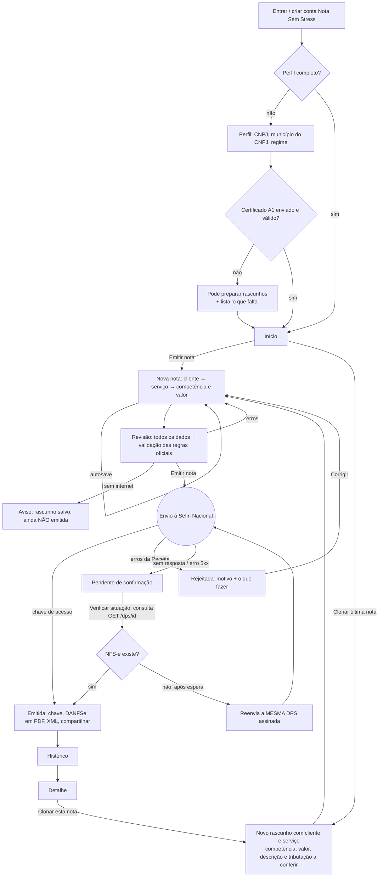

## 2.3 Telas

| # | Tela | Imagem |
|---|---|---|
| 1 | Entrar / criar conta (explica que não usamos senha gov.br) | 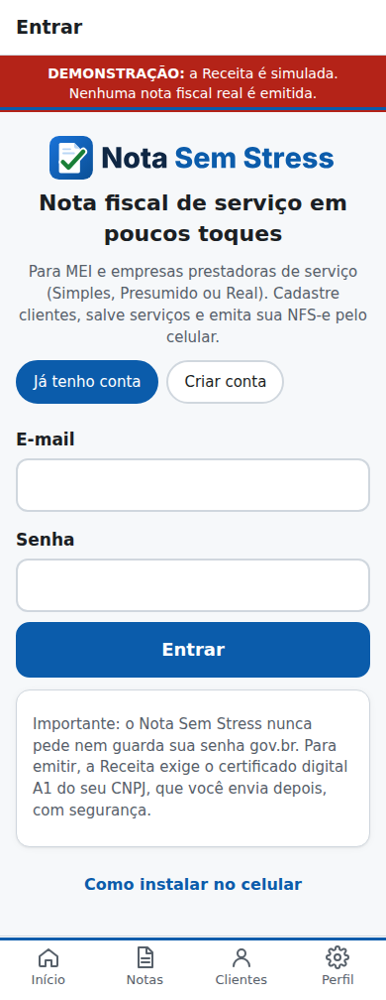 |
| 2 | Perfil com a lista "O que falta para emitir" | 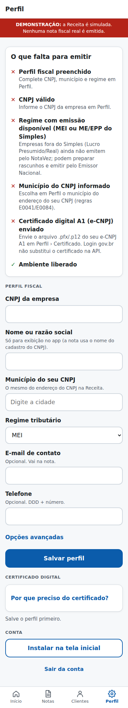 |
| 3 | Perfil pronto: certificado verificado e guardado cifrado | 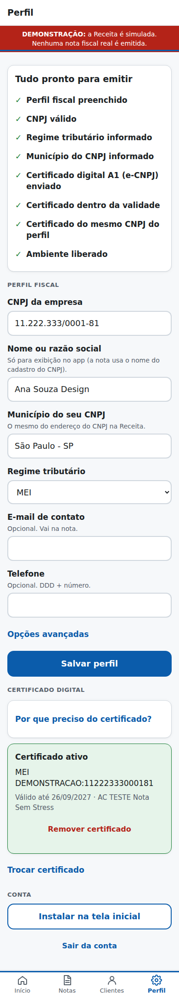 |
| 4 | **Início**: Emitir nota, Clonar última nota, Clientes e a última emissão | 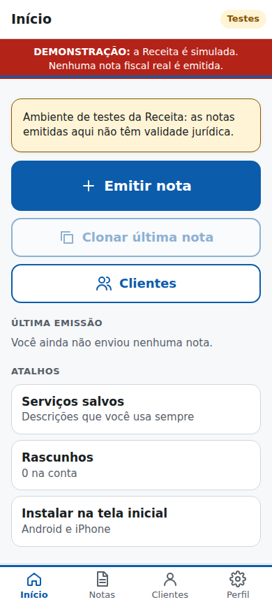 |
| 5 | **Clientes**: cadastro com CPF/CNPJ, endereço exigido só para CNPJ | 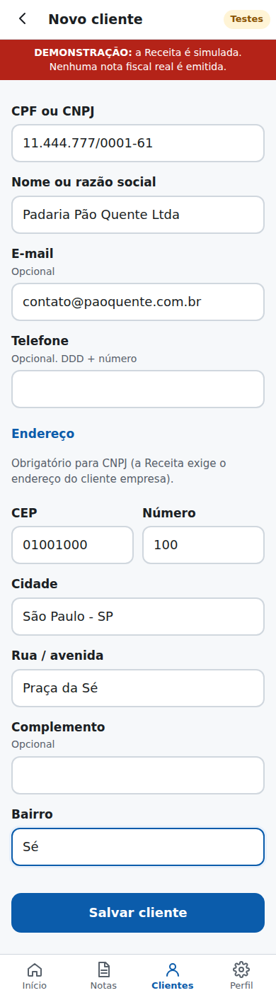 |
| 6 | Clientes: busca por nome, CPF ou CNPJ | 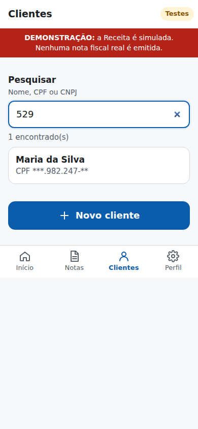 |
| 7 | **Serviços salvos**: busca na lista nacional com palavras do dia a dia | 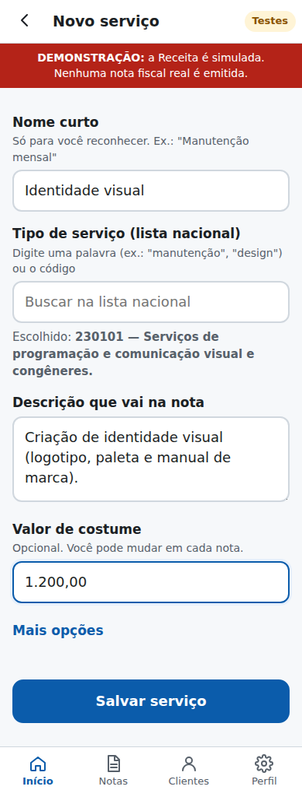 |
| 8 | **Nova nota**: cliente, serviço, competência e valor; tributação do MEI explicada | 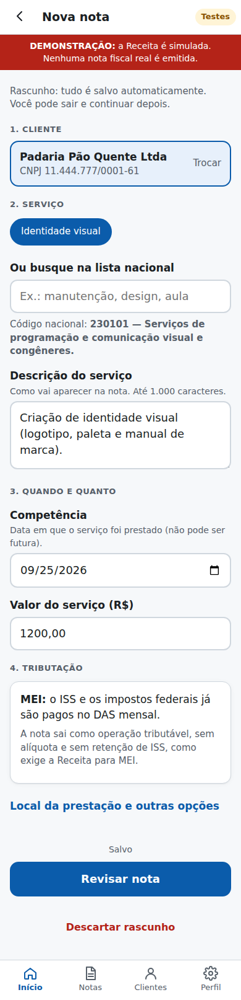 |
| 9 | **Revisão**: todos os dados antes de "Emitir nota" | 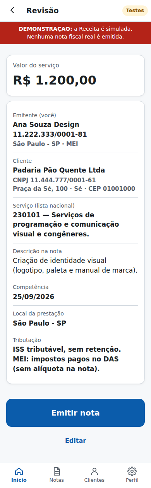 |
| 10 | **Resultado — Emitida**: chave de acesso, "Enviar ao cliente" (DANFSe em PDF + XML), ver DANFSe, baixar XML | 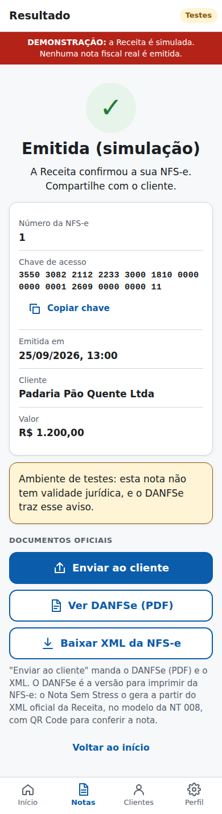 |
| 11 | **Nota clonada**: campos a conferir destacados | 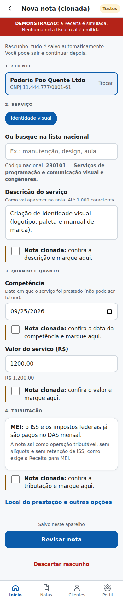 |
| 12 | **Resultado — Rejeitada**: motivo em linguagem comum + código oficial | 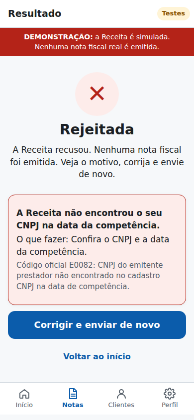 |
| 13 | **Resultado — Pendente de confirmação**: "não emita de novo" | 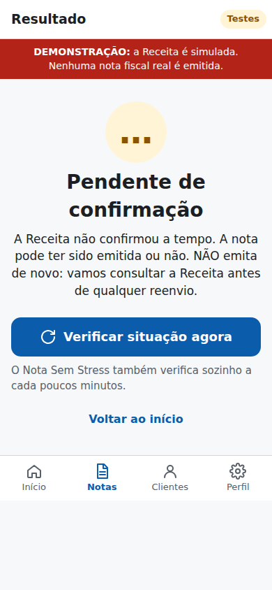 |
| 14 | Pendente confirmada após a consulta |  |
| 15 | **Histórico** com filtros por situação | 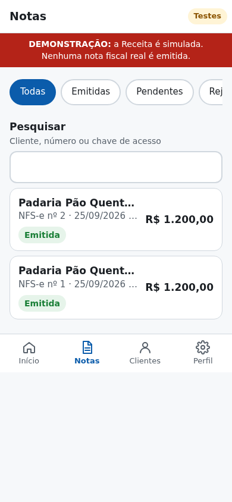 |
| 16 | Detalhe da nota, registro de comunicação e "Clonar esta nota" | 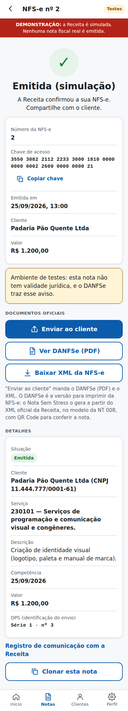 |
| 17 | Sem internet: prepara o rascunho, com aviso de que não foi emitida | 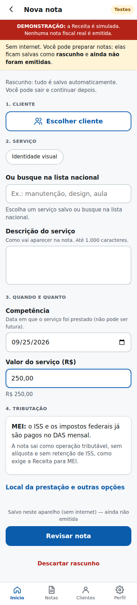 |
| 18 | Sem internet na revisão: emissão indisponível | 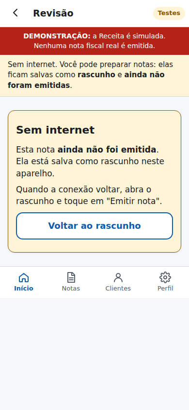 |
| 19 | **Instalar na tela inicial** (Android e iPhone) | 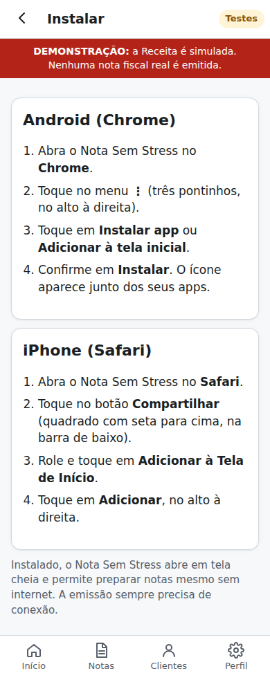 |

### ME/EPP do Simples Nacional

Os campos extras aparecem **só para ME/EPP**, e a alíquota do ISS aparece **só quando a regra oficial exige** (retenção pelo cliente, ou ISS fora do Simples em município não conveniado).

| # | Tela | Imagem |
|---|---|---|
| 20 | Perfil: regime "ME/EPP — Simples Nacional", forma de apuração, % de tributos e alíquota do ISS para retenção | 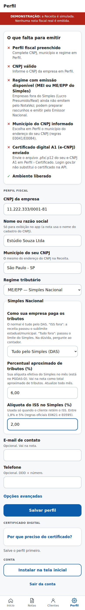 |
| 21 | Perfil pronto: convênio do município conferido com o certificado | 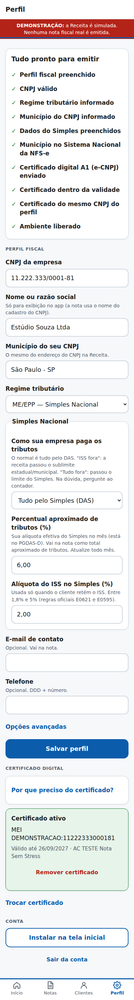 |
| 22 | Nova nota: "O cliente vai reter o ISS" e alíquota com o valor do perfil | 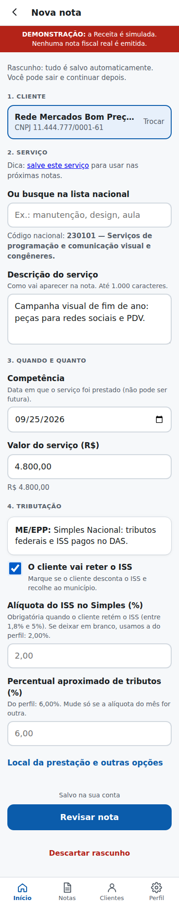 |
| 23 | Revisão: tributação resumida e ISS retido estimado | 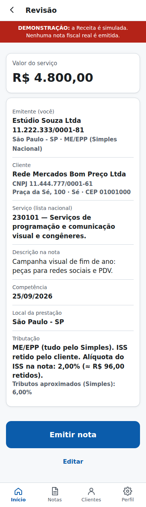 |
| 24 | Resultado: emitida | 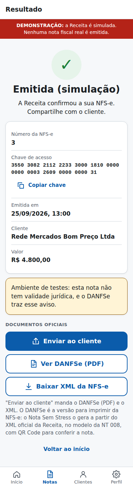 |

## 2.4 Navegação

- Abas fixas: **Início · Notas · Clientes · Perfil**. Serviços salvos e rascunhos ficam nos atalhos do Início.
- A escolha de cliente ou serviço a partir da nota abre a lista em "modo seleção" (`#/clientes?para=<nota>`) e volta para a nota com o item aplicado. Dá para cadastrar um novo cliente no meio do caminho sem perder a nota.
- Atalhos do ícone instalado (manifest): "Emitir nota", "Clonar última nota", "Clientes".

## 2.5 Instruções de instalação (também dentro do app, em Perfil › Instalar)

**Android (Chrome):** abrir o Nota Sem Stress no Chrome → menu **⋮** → **Instalar app** (ou **Adicionar à tela inicial**) → **Instalar**. Quando o navegador permite, o app mostra o botão **Instalar agora**.

**iPhone (Safari):** abrir o Nota Sem Stress no Safari → botão **Compartilhar** (quadrado com seta para cima) → **Adicionar à Tela de Início** → **Adicionar**.

### Lucro Presumido / Lucro Real

A seção de tributação mostra ISS (retenção e alíquota só quando exigida), **retenções federais** no formato da NT 007 (PIS/COFINS/CSLL somados) e o **IBS/CBS** com as opções oficiais para o serviço (NBS, forma de prestação, classificação e uso pessoal). A revisão estima o líquido a receber.

| # | Tela | Imagem |
|---|---|---|
| 25 | Perfil: Lucro Presumido, PIS/COFINS (com alíquotas padrão a confirmar), tributos aproximados e alíquota do ISS | 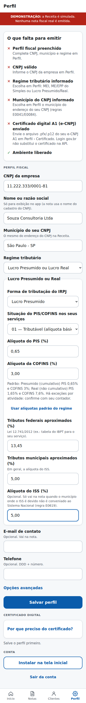 |
| 26 | Nova nota: ISS retido, retenções federais (4,65%), IRRF e IBS/CBS (NBS e uso pessoal) | 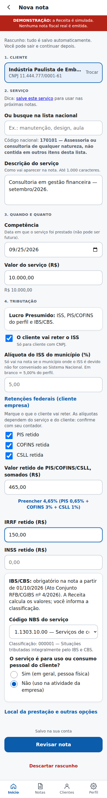 |
| 27 | Revisão: tributação completa, líquido estimado e classificação IBS/CBS | 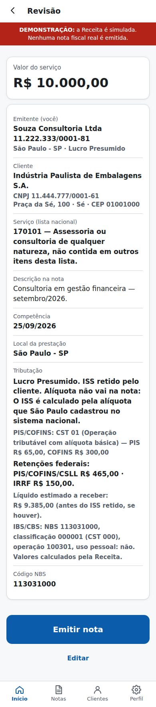 |
| 28 | Resultado: emitida | 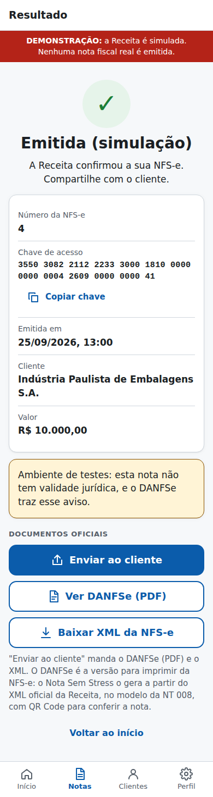 |

### DANFSe (NT 008)

O DANFSe é gerado pelo servidor a partir do XML oficial da NFS-e. Abaixo, o do modo demonstração: tem "NFS-e SEM VALIDADE JURÍDICA" (homologação) e a marca d'água "SIMULAÇÃO". [Exemplo em PDF](exemplos/danfse-demonstracao.pdf).

| # | Tela | Imagem |
|---|---|---|
| 29 | DANFSe em PDF, página única, com QR Code da Consulta Pública | 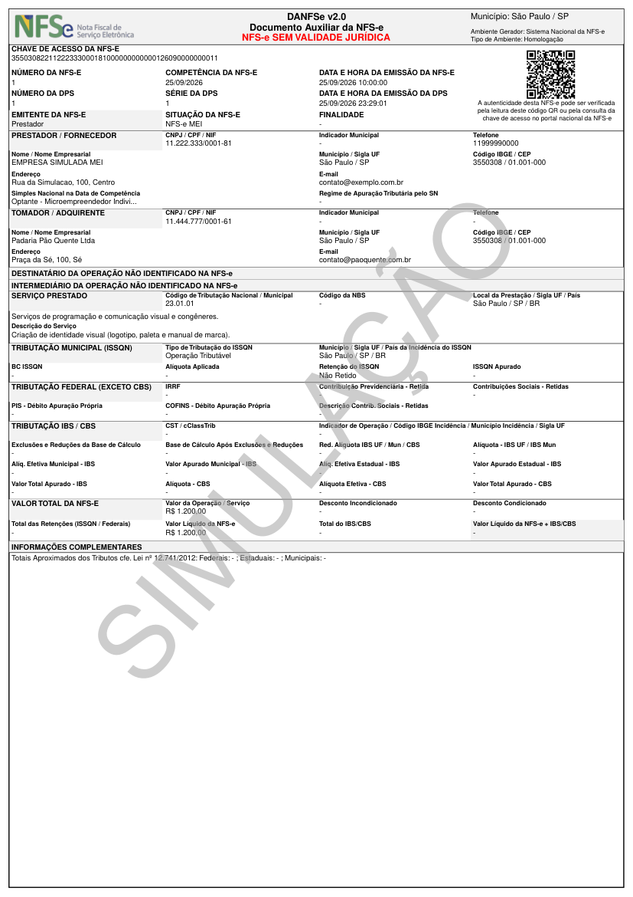 |

## 2.6 Identidade visual

- **Persona:** dono de MEI ou de pequena empresa, no celular, sem formação fiscal. Quer emitir a nota do mês em menos de um minuto e ter certeza de que deu certo.
- **Personalidade:** confiável e acolhedora. Azul institucional para transmitir segurança, verde reservado à confirmação ("Emitida"), vermelho e âmbar só para erro e atenção.
- **Logo:** um documento com um "✓" verde que sai da folha: a nota pronta, sem stress. O check é o mesmo sinal de "Emitida" dentro do app. Funciona de 16 px (favicon) a 512 px e tem versão *maskable* para Android. Logotipo em Inter ExtraBold convertida em curvas: "Nota" em tinta escura e "Sem Stress" em azul, com versão para fundo escuro. No ícone instalado, o nome curto é "Sem Stress", porque "Nota Sem Stress" é cortado nas telas iniciais do Android e do iPhone.
- **Tokens:** azul `#0b5cab`, verde `#1a7f37`, vermelho `#b42318`, âmbar `#8a5300`, tinta `#0f2744`; fonte do sistema; espaçamento em múltiplos de 4 e 8 px; raio de 14 px. Os mesmos tokens valem para o app (`web/css/app.css`) e para a página de apresentação (`docs/index.html`).
- **Arquivos:** `web/icons/` (logo.svg, logo-escuro.svg, icone.svg, icone-maskable.svg, PNG 180/192/512, favicon de 32 px) e cópias em `docs/assets/`.
