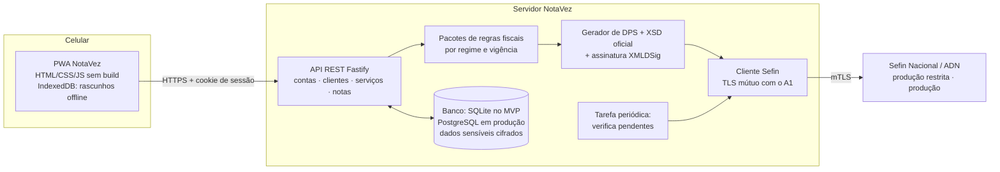
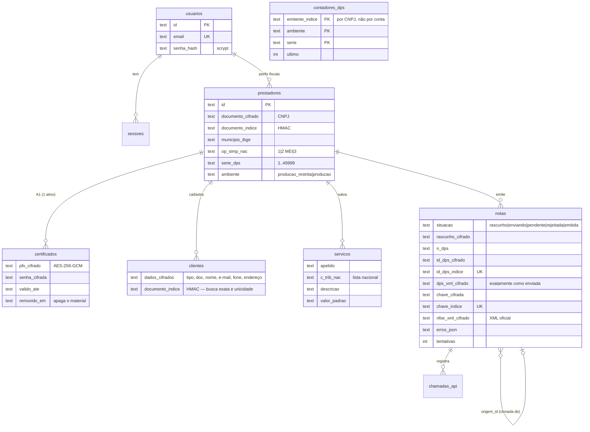
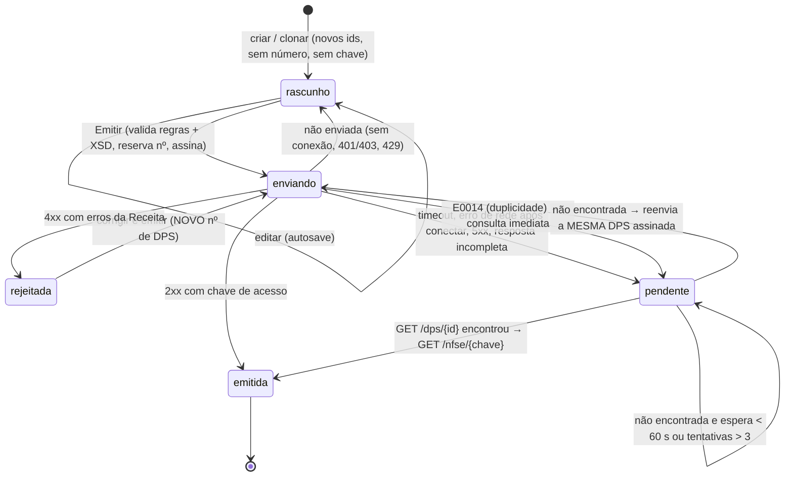
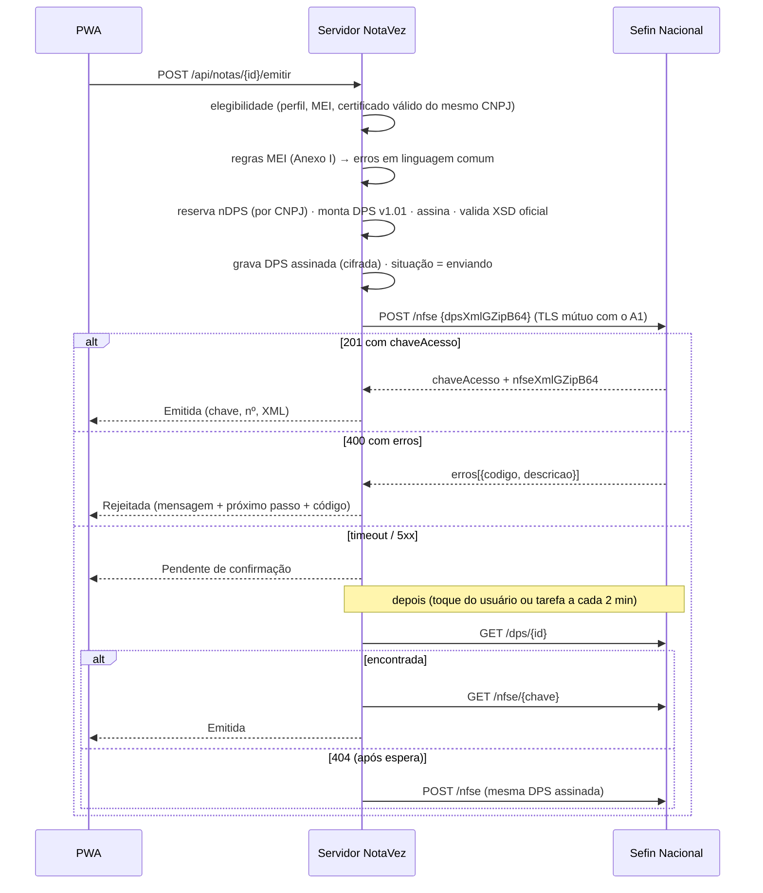

# 3. Modelo de dados e desenho da integração com a API

## 3.1 Arquitetura

- **Separação:** o PWA (`web/`) é estático e pode ser servido por qualquer CDN; o servidor (`server/`) concentra contas, dados, regras e integração. No MVP o servidor também serve o PWA, para simplificar a implantação (mesma origem e cookie `SameSite=Strict`).
- **Regras atualizáveis:** o leiaute (XSD), as tabelas (Anexos A, B e I) e os endereços dos ambientes ficam em arquivos de dados. As regras de negócio ficam em **pacotes por regime e vigência** (`server/src/fiscal/regras/`). Novos regimes (ME/EPP) e novas vigências (IBS/CBS 2027) entram como novos pacotes, sem mudar telas nem o fluxo de emissão.

## 3.2 Modelo de dados

Tabelas adicionais: `auditoria` (operações sem dados pessoais) e `chamadas_api` (cada chamada à Receita: operação, HTTP, resultado, códigos, duração).

**Por que o Id da DPS e a chave de acesso são cifrados:** os dois contêm o CPF/CNPJ do emitente. Para buscas e unicidade usamos índices cegos (HMAC com chave derivada).

**Numeração da DPS:** o contador é por **emitente** (CNPJ), ambiente e série, e não por conta. Duas contas do mesmo CNPJ, por exemplo o MEI e o contador dele, compartilham a sequência e não geram a rejeição E0014. Um número nunca é reutilizado: rejeitada → próximo envio com número novo.

## 3.3 Máquina de estados da nota

Garantias:

1. **"Emitida" só com a chave de acesso oficial.** Qualquer dúvida vira "pendente".
2. **Consultar antes de reenviar:** o reenvio só acontece depois que `GET /dps/{id}` responde "não encontrada", passado o tempo mínimo de espera (`NOTAVEZ_ESPERA_REENVIO_MS`, padrão 60 s).
3. **O reenvio é idempotente:** usa o **mesmo XML assinado** (mesmo Id). Se a primeira tentativa tiver sido processada nesse meio-tempo, a Receita responde E0014, e o NotaVez consulta e recupera a nota. Não há como gerar duas NFS-e para o mesmo rascunho.
4. **Travas:** transição de estado atômica (compare-and-set no banco) e trava por nota no processo, contra toque duplo.
5. **Clonar** copia só cliente, serviço, descrição, valor e local. Nunca copia número de DPS, Id, chave, XML ou situação. Competência, valor, descrição e tributação ficam marcados em `revisar` e bloqueiam a emissão até serem conferidos.

## 3.4 Sequência de emissão

## 3.5 Detalhes da integração

| Tema | Implementação | Arquivo |
|---|---|---|
| Leiaute | DPS v1.01 montada na ordem do XSD; escape XML; `dhEmi` com fuso -03:00 recuado 60 s (E0008) | `server/src/fiscal/dps.js` |
| Validação | XSD oficial `esquemas-nfse-rtc-v1-01-20260727`, via `xmllint-wasm`, **antes do envio** | `server/src/fiscal/xsd.js` |
| Assinatura | XMLDSig enveloped sobre `infDPS` (Reference `#Id`), RSA-SHA256, digest SHA-256, C14N, `X509Certificate` no KeyInfo | `server/src/fiscal/assinatura.js` |
| Certificado | Leitura do PKCS#12, localização do OID 2.16.76.1.3.3 (CNPJ), checagem de validade, uso e cadeia ICP-Brasil | `server/src/fiscal/certificado.js` |
| Transporte | HTTPS com `key`/`cert` do A1 (convertido para PEM, compatível com PFX antigos), keep-alive, timeout configurável; corpo GZip + Base64 | `server/src/fiscal/sefin/cliente.js` |
| Classificação | Erros **antes da conexão TLS** = "não enviada"; depois da conexão = "incerta" | idem |
| Mensagens | Códigos oficiais → texto comum + próximo passo; códigos desconhecidos mostram a descrição oficial | `server/src/fiscal/mensagens.js` |
| Ambientes | URLs em JSON; homologação é o padrão; produção exige `NOTAVEZ_PRODUCAO_LIBERADA=1` | `server/src/fiscal/sefin/ambientes.json` |

## 3.6 Segurança e privacidade (LGPD)

- **Senha gov.br:** nunca é pedida nem armazenada.
- **Certificado A1:** chega por HTTPS com consentimento explícito e é verificado na hora (senha, CNPJ igual ao do perfil, validade, ICP-Brasil). Fica guardado com **AES-256-GCM**, junto com a senha, usando chave derivada (HKDF) da chave mestra `NOTAVEZ_MASTER_KEY`, que em produção deve vir de um **KMS/HSM**. Nunca volta para o aplicativo. "Remover" apaga o material criptográfico, não só marca como removido.
- **Dados de clientes:** CPF/CNPJ, nome, contato e endereço ficam cifrados. A busca por documento usa HMAC; a busca por nome é feita em memória, só com os clientes do próprio usuário. Nas listas, o CPF aparece mascarado.
- **Rascunho, DPS e XML:** cifrados em repouso. O teste automatizado confere que CPF, CNPJ e nome não aparecem em claro no banco.
- **Sessão:** cookie `HttpOnly`, `Secure` e `SameSite=Strict`; token aleatório de 256 bits guardado como HMAC. Proteção CSRF por cabeçalho `X-NotaVez` obrigatório nas alterações. Limite de 5 tentativas de login a cada 15 min.
- **Cabeçalhos:** CSP restritiva (`default-src 'self'`, sem scripts inline), HSTS, `X-Frame-Options: DENY`, `no-store` nas respostas da API.
- **No aparelho:** o service worker guarda só a "casca" do app, nunca respostas da API. Rascunhos e cópias de apoio ficam no IndexedDB e são apagados ao sair da conta.
- **Registro de operações:** `auditoria` (quem, o quê, quando, IP, sem dados pessoais) e `chamadas_api` (todas as chamadas à Receita).
- **Isolamento:** toda consulta filtra pelo prestador da sessão (testado).
